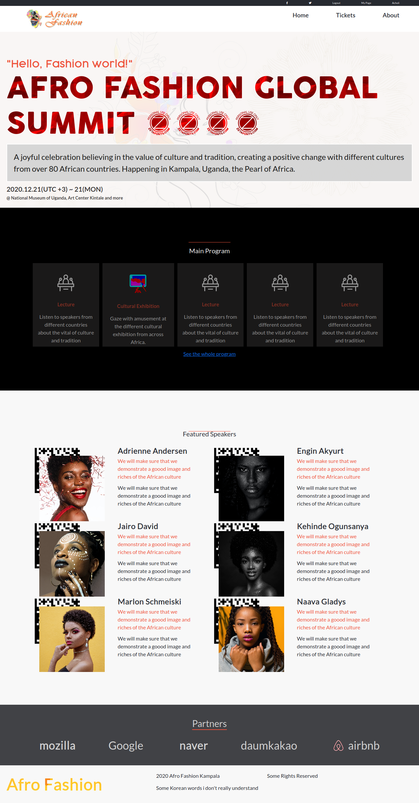

# Afro Fashion (Capstone 1 Html and Css)
HTML5 and CSS3 Capstone Project is based on an online website for a an imaginary annual African Fashion Summit that takes place in the heart of Kampala. Built to demonstrate knowledge gained from the HTML and CSS3 module over the past 3 weeks.

### Desktop version

## Built With

- HTML5
- CSS3
- Bootstrap5 Beta
- CSS Grid
- Flexbox

## Live Demo

[Live Demo Link](https://oxenprogrammer.github.io/dev-conference/)

## Getting Started

To get a local copy up and running follow these simple example steps.

### Setup
Checkout the project on your web browser with the provided link.

### Deployment
Deploy on gh pages for testing purposes, please check the live demo

## Authors

👤 **Emmanuel Okello**

- GitHub: [@githubhandle](https://github.com/oxenprogrammer)
- Twitter: [@twitterhandle](https://twitter.com/ox_emmy)
- LinkedIn: [LinkedIn](https://www.linkedin.com/in/emanuel-okello-1217b4b3/)

## 🤝 Contributing

Contributions, issues, and feature requests are welcome!

## Show your support

Give a ⭐️ if you like this project!

## Acknowledgments
This Design is inspired by the works of Cindy Shin in Behance

- https://www.theodinproject.com/
- https://www.behance.net/gallery/29845175/CC-Global-Summit-2015
- pexels.com

## 📝 License

This project is [Creative Commons Legal Code](./LICENSE) licensed.
